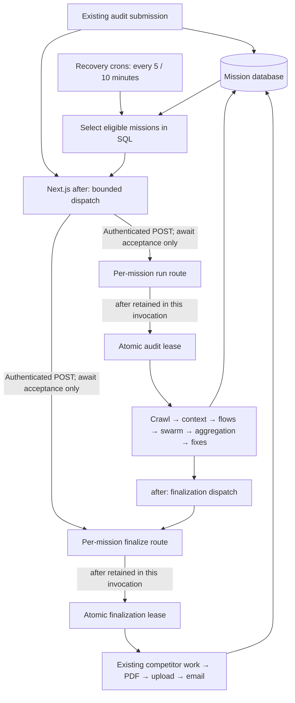

# Mission execution reliability

## Verification before edits

- `run-missions/route.ts`: confirmed direct sequential `await runAuditMission(id, {force:true})`; 800-second invocation, every five minutes, default batch three, cap ten. All audits share that invocation's budget.
- `finalize-missions/route.ts`: confirmed sequential `await finalizeMission(id)`; 800 seconds, every ten minutes, default five, cap twenty. Same shared-budget problem.
- `run-audit-mission.ts`: checks JSON progress then separately writes running state. No atomic claim. Force bypasses the active-run guard. Two workers can race.
- `finalize-mission.ts`: no worker claim. Completion checks do not serialize PDF generation/upload or side effects.
- GA4 sync uses conditional `updateMany` with token/expiry: atomic acquisition is the reusable pattern. Its release/persist operations are not token-fenced, so copy the acquisition idea, not that weakness.
- `STALE_RUNNING_MS` is 720,000 ms (12 minutes), despite a comment claiming it exceeds the 800-second route limit. Polling can write an error based on a stale read while a worker remains alive; error status also removes it from normal recovery selection.
- The shared Anthropic client currently allows two SDK retries with an environment-configurable 180-second timeout. Personas add a non-cancelling 90-second race. Competitor helpers add another 180-second race and immediate retry; they omit 429 and do not cancel timed-out requests. Aggregation, flows, synthesis and fixes rely only on SDK timeout/retries.
- No production duration history or metrics were available in the repository. Minimum/typical elapsed duration is unmeasured and must not be inferred from fixtures. The maximum is demonstrably not bounded below 800 seconds: 250 static page fetches at concurrency four with a 15-second timeout can alone approach 945 seconds in timeout-heavy batches; dynamic rendering and sitemap discovery add work. Up to 100 flows at concurrency six add multiple LLM waves. Existing crawl limits/methodology will not be changed.
- Email notification logging currently happens before sending and send failure is swallowed, which can mark a failed delivery as complete.

## Implementation design

Keep Next.js and the per-mission routes. Cron dispatches authenticated parallel POST requests with `dispatch=1`, waits only for bounded acceptance responses, then returns. The destination uses Next.js `after()` to retain its own invocation for the worker; ordinary synchronous route calls retain their existing response contract. Submission triggers also use supported `after()`, not floating promises. Next's runtime supports nested after callbacks and retains them via waitUntil (verified in installed Next 15.5.20 source and https://nextjs.org/docs/app/api-reference/functions/after).

Use conditional PostgreSQL UPDATE claims in the existing Mission.progress JSON, avoiding a schema migration. Each phase has a token, acquisition/expiration times and attempt counter. Lease TTL is 900 seconds (800-second platform ceiling plus 100 seconds margin); no progress-heartbeat guess can expire a healthy in-budget worker. Force never bypasses a live lease. Reclaims and releases are token-fenced, and expired workers cannot publish mission state. Crashed jobs remain running/recoverable; legacy unleased runs get the same 15-minute grace. Cron schedules stay unchanged.

Use one cancellation-aware, bounded LLM retry policy across all structured calls, disabling nested SDK retries per call. Keep existing configured timeouts, use exponential backoff, respect rate limits, and distinguish transport/timeout/429/5xx from terminal errors. Log structured invocation and stage timings without prompt/source/credential payloads. These changes do not make a workload exceeding the platform limit fit; the timing evidence will determine when durable workers are justified.

## Verified findings and disposition

| Finding | Confirmed? | Fixed? | Repository evidence / result |
| --- | --- | --- | --- |
| Audit cron runs jobs sequentially within one budget | Yes | Yes | Original route awaited `runAuditMission` in a loop, default 3 / cap 10, every 5 minutes, 800 seconds. Now parallel authenticated acceptance requests; cron budget 60 seconds; worker route stays 800 seconds. |
| Finalization cron shares a budget across jobs | Yes | Yes | Original route awaited `finalizeMission`, default 5 / cap 20, every 10 minutes, 800 seconds. Same dispatch separation applied. |
| Audit execution guard is non-atomic | Yes | Yes | Separate progress read and running write; `force` bypassed the guard. A single conditional PostgreSQL UPDATE now claims the job. Eight simultaneous forced claims yielded exactly one owner in the database test. |
| Finalization has no distributed lock | Yes | Yes | Completion checks previously allowed overlapping PDF/upload/email work. Finalizers now acquire their own atomic lease before any work. |
| GA4 provides a reusable lease pattern | Yes | Applied | Retained conditional database acquisition with token/expiry. Mission claims additionally fence state writes and release by token. Existing GA4 implementation was not changed by this refactor. |
| Stale watchdog can kill a legitimate worker | Yes | Yes | 720 seconds was shorter than the declared 800-second worker limit. Current 900-second leases govern recovery; stale polling no longer makes abandoned jobs terminal errors. |
| LLM timeout/retry behavior is inconsistent | Yes | Yes | All ten structured call sites now pass an AbortSignal, disable nested SDK retries, and use the same bounded policy, including aggregation. |
| Audits reliably fit in 800 seconds | Not established | Not claimed | No production duration history. Timeout-heavy crawl arithmetic already exceeds 800 seconds; crawl limits and methodology remain unchanged. |
| Recovery selection can starve newer jobs | Yes | Yes | SQL now filters eligible jobs before LIMIT instead of scanning a small oldest-row sample then filtering in application code. |
| Failed email delivery can be marked complete | Yes | Yes, with external-delivery limits below | Notification is recorded after successful provider response. Stable provider idempotency key protects ambiguous retries within provider retention. |

## Architecture after the change



The new `dispatch=1` mode returns the existing response shape when scheduling succeeds. Its `ok` means accepted, not finished. Existing synchronous per-mission calls still wait for execution and return outcome fields. Cron response field names remain unchanged, but their results now describe dispatch acceptance; finalization `pdfOk`/`emailOk` are false until work actually finishes. Completion is read from the mission. Authentication, schedules and batch limits are unchanged.

`NEXT_PUBLIC_APP_URL` must be the reachable deployment origin and `CRON_SECRET` must match on sender/receiver. Each dispatch awaits the response with a ten-second timeout, rejects redirects, and logs sanitized failure reasons. An uncertain acceptance can safely be redispatched because the worker must claim the database lease. No new queue or schema is required. Next.js retains the worker using [`after()`](https://nextjs.org/docs/app/api-reference/functions/after), whose lifetime remains subject to the route's configured/platform-supported duration.

## Lease and retry behavior

- `progress.auditLease` and `progress.finalizeLease` store token, acquisition time, expiration, attempt, and the latest completed attempt's timing/failure metadata. Acquisition uses the database clock and a conditional UPDATE. A live lease cannot be bypassed by `force`.
- Fifteen minutes is the configured 800-second worker budget plus 100 seconds of margin. Healthy workers are not judged by the gap between progress writes. Legacy unleased running work receives a 15-minute grace; pending work can start immediately.
- Normal return or error releases only the matching token. If the process is killed, expiry makes the job eligible again. Delayed progress/report/PDF/intelligence writes are fenced, so an old owner cannot overwrite its successor. Work outside the lease context retains its existing behavior.
- Recovery occurs on the next eligible cron sweep: approximately 15–20 minutes from acquisition for audit recovery and 15–25 for finalization, assuming no backlog, database outage or dispatch failure. A crash late in an invocation waits only the remaining lease time plus the cron interval.
- Explicit audit errors remain terminal, matching existing behavior; a forced retry can reclaim an error mission once no lease is live. Partial finalization remains retryable. Recovery also repairs finalization state when a crash occurs after successful PDF/email persistence.
- Each structured LLM operation gets at most three attempts. Timeout defaults to 180 seconds and honors `GHOST_STRUCTURED_PARSE_TIMEOUT_MS` within 1–300 seconds; the underlying SDK transport also has its configured timeout. Timeouts abort the request. HTTP 408/409/429/5xx and actual SDK connection errors retry; terminal request/auth/validation failures and caller cancellation do not. Backoff is 1s, then 2s, with jitter and a Retry-After allowance capped at 60s. No retry writes a second report: persistence follows successful pipeline completion under the lease.
- Structured logs include mission ID, lease token as invocation ID, attempt, start time, retry count, stage duration, failure classification and total invocation duration. Timed stages include crawl, context synthesis, flow analysis, swarm, aggregation, fixes and finalization. Skipped stages are absent, not represented as measured zero. Latest attempt totals also remain in mission progress. Killed processes cannot emit a finish log; an unreleased expired lease identifies that case.

## Files changed for this reliability refactor

Earlier GA4/UI/report work was already present and is not attributed to this change. No schema, prompt, pricing, entitlement or UI changes were needed here. The existing uncommitted SDK timeout configuration in `src/lib/ghost-engine/client.ts` was preserved.

| File | Change |
| --- | --- |
| `.env.example` | Documents LLM timeouts and corrects the existing competitor-budget comment. |
| `docs/mission-reliability.md` | Verification, design, evidence, reproduction, limits and scaling decision. |
| `src/app/api/cron/run-missions/route.ts` | Parallel bounded run dispatch instead of executing audits. |
| `src/app/api/cron/finalize-missions/route.ts` | Parallel bounded finalization dispatch instead of executing jobs. |
| `src/app/api/missions/[id]/run/route.ts` | Opt-in acceptance response and retained `after()` worker. |
| `src/app/api/missions/[id]/finalize/route.ts` | Same finalization execution boundary. |
| `src/lib/missions/dispatch.ts` | Shared authenticated, timed dispatch with safe failure logging. |
| `src/lib/missions/execution-context.ts` | Invocation context, stage timing and expired-context guard. |
| `src/lib/missions/lease.ts` | Atomic phase claims, ownership checks, fenced release and timing persistence. |
| `src/lib/missions/run-audit-mission.ts` | Mandatory lease, preserved error responses, retryable recovery selection. |
| `src/lib/missions/finalize-mission.ts` | Mandatory lease, external-side-effect ownership checks, SQL recovery selection. |
| `src/lib/missions/trigger-mission-run.ts` | Supported after-response dispatch instead of a floating promise or resetting live progress. |
| `src/lib/missions/trigger-finalize.ts` | Same safe scheduling and dispatch. |
| `src/lib/db/missions.ts` | Fenced mission writes and non-terminal stale recovery. |
| `src/lib/db/fix-status.ts` | Record notifications after successful delivery; propagate delivery/database failures. |
| `src/lib/auth/resend.ts` | Stable audit-completion idempotency key and timed PDF attachment fetch. |
| `src/lib/ghost-engine/util.ts` | Cancellation, error classification, bounded retry/backoff and retry logging. |
| `src/lib/ghost-engine/flows.ts` | Shared abort-aware LLM policy. |
| `src/lib/ghost-engine/swarm.ts` | Shared policy replaces non-cancelling persona timeout. |
| `src/lib/ghost-engine/aggregate.ts` | Shared abort-aware policy for aggregation. |
| `src/lib/ghost-engine/fixes.ts` | Shared abort-aware policy for fix generation. |
| `src/lib/ghost-engine/ingest/buildContextPack.ts` | Shared abort-aware policy for context synthesis. |
| `src/lib/ghost-engine/ingest/index.ts` | Crawl/context stage durations. |
| `src/lib/ghost-engine/pipeline.ts` | Flow/swarm/aggregation/fix stage durations. |
| `src/lib/competitor-intelligence/search.ts` | Pass abort signal and disable nested SDK retries. |
| `src/lib/competitor-intelligence/rank.ts` | Same retry/cancellation policy. |
| `src/lib/competitor-intelligence/extract-features.ts` | Same retry/cancellation policy. |
| `src/lib/competitor-intelligence/score-themes.ts` | Same retry/cancellation policy. |
| `src/lib/competitor-intelligence/gap-analysis.ts` | Same retry/cancellation policy. |
| `tests/mission-reliability.test.ts` | LLM timeout, SDK error classification, backoff and safe dispatch unit tests. |
| `tests/mission-reliability.integration.ts` | Real PostgreSQL/route/pipeline concurrency and failure tests with external I/O fixtures. |
| `tests/mission-dispatch-http-smoke.ts` | Real production Next.js HTTP/after boundary while the database claim is blocked. |

## Validation results (local, 2026-09-22)

| Scenario | Result | What was exercised |
| --- | --- | --- |
| Single audit through finalization | Passed | Real route dispatch, AI-stage orchestration, report persistence, finalizer and notification log; crawl/provider/PDF/storage I/O fixtures. |
| Three simultaneous audits, one blocked crawl gate | Passed | Both cron responses arrived before worker execution; all three missions completed with exactly 12 structured calls and three PDFs/uploads/emails. |
| Duplicate cron/forced worker claims | Passed | Six dispatches for three missions still executed one audit each. Separately, eight concurrent forced SQL claims produced exactly one owner. |
| Crash/lease expiry | Passed | Simulated a dead owner by expiring its lease in PostgreSQL. Recovery reclaimed it; predecessor writes and release could not overwrite the successor. Retry completed. |
| Healthy slow worker/stale poll | Passed | An old progress timestamp did not invalidate a live lease; a stale poll did not overwrite a completed report. |
| LLM timeout → retry → success | Passed | Request abort observed, 1-second backoff requested, second attempt succeeded. Actual SDK connection-error classes also tested. |
| LLM timeout → exhaustion | Passed | Three aborted attempts, two retries, real aggregation failure persisted mission error and released lease with failure/timing evidence. |
| Duplicate finalizers | Passed | One PDF, one upload, one email attempt for simultaneous forced calls. Failed delivery left no notification record and stayed recoverable; retry reused the PDF. |
| Crash after delivery record, before final state | Passed | Pending state was selected again, repaired without another PDF or email. |
| Cron execution duration | Passed locally | Both route handlers returned in under the test's one-second threshold while worker crawling was blocked. External dispatch/after scheduling is fixture-controlled in these integration tests. |
| Real Next.js HTTP lifetime | Passed | Isolated production build accepted in **31 ms** while row lock blocked finalization claim. After unlocking, retained worker completed and released lease (9 ms measured finalization). These are fixture timings, not production audit measurements. |
| Recovery selection/authentication | Passed | Completed old rows did not hide eligible newer work; unauthenticated route/cron requests returned 401. |

`npm test`: **47 passed**. PostgreSQL integration suite: **7 passed**, covering the scenarios above. `npm run typecheck`: passed. Production build: passed, including a clean isolated build. Existing Chromium loader `createRequire` tracing warnings remain; real serverless Chromium/PDF execution was not validated. `git diff --check`: passed.

Tests used a disposable local PostgreSQL cluster, not the configured production database. Integration tests deliberately replace crawling, Anthropic responses, PDF generation, storage and HTTP scheduling; real email formatting/SDK transport runs against a fake fetch responder. The separate smoke test uses real Next.js HTTP and `after()` with an already-generated PDF and no recipient, requiring no external service. No live audit, production deployment, real email delivery, live Google/Anthropic call or Vercel platform kill test was performed.

Reproduce unit checks with `npm test` and `npm run typecheck`. For database scenarios, create an empty local PostgreSQL database named exactly `ghost_reliability`, push the existing Prisma schema to that database with explicit `DATABASE_URL` and `DIRECT_URL` overrides, then run:

```sh
MISSION_TEST_DATABASE_URL=postgresql://USER@localhost:PORT/ghost_reliability \
  node --import tsx --test tests/mission-reliability.integration.ts
```

The integration suite deletes fixture rows; it rejects non-local hosts and any other database name. For the HTTP smoke test, point a separate production `next start` instance at the same disposable database, with `CRON_SECRET` and `NEXT_PUBLIC_APP_URL` set for it. Set `MISSION_TEST_DATABASE_URL`, `MISSION_TEST_APP_URL` and matching `CRON_SECRET`, then run `node --import tsx tests/mission-dispatch-http-smoke.ts`. Use a separate build directory/copy if a development server is active: sharing `.next` can mix development and production artifacts.

## Remaining risks and operating limits

1. **Runtime headroom is unmeasured.** There is no defensible minimum/typical production duration available. Small cached audits may finish quickly, but no numerical estimate is claimed. Even the static crawl can approach 945 seconds under the current limits, before dynamic rendering, multiple LLM waves and retries. A single default LLM operation can take about 543.5 seconds including two ordinary backoffs, or about 660 seconds with two maximum Retry-After waits. The existing competitor pipeline can retry its entire budget twice. A fixed 800-second worker cannot guarantee these worst cases; this refactor does not change methodology or crawl coverage to hide that limit.
2. **Supported background lifetime, not a durable queue.** `after()` retains the invocation but does not survive a platform kill. PostgreSQL records and cron sweeps recover lost invocations by restarting work, without stage checkpoints. Repeated kills can repeatedly consume crawl/AI cost. Verify deployed plan/runtime supports the requested 800-second duration; a declaration alone does not prove the deployed limit. Dispatch also depends on origin reachability, deployment protection, secret configuration and database latency.
3. **Recovery has deliberate latency.** Fifteen-minute leases avoid falsely killing healthy workers. Backlogs and outages can extend recovery beyond the nominal next-sweep window. JSON eligibility queries have no dedicated new index; monitor query latency and queue age as mission volume grows.
4. **External side effects are not transactionally exactly-once.** Concurrent finalizers are serialized and published mission state is fenced. Resend deduplicates the stable key for [24 hours](https://resend.com/docs/dashboard/emails/idempotency-keys). An accepted send followed by a lost database write can still duplicate if retried after that window; changing the email/PDF payload under the same key may cause a provider conflict. PDF generation/upload uses existing timeouts and storage behavior; a crash between upload and recording its URL can repeat the upload. An already-sent external request cannot be recalled by a database fence.
5. **Other entry points retain their behavior.** On-demand PDF download/backfill/regeneration paths were not migrated into this lease boundary and can still contend for PDF resources. Existing competitor/PDF overall timeout races do not cancel every underlying browser/task; LLM requests are now cancellable, and late mission writes from a released worker are fenced. Further cancellation/checkpoint work should be driven by observed failures.
6. **Rollout compatibility.** Legacy in-flight unleased workers cannot gain ownership fences retroactively. Drain old invocations during rollout or allow their maximum lifetime to elapse before relying on the new exclusivity guarantee. Existing historical notification records written before sending cannot prove delivery retroactively.
7. **Local validation limits.** Browser PDF rendering, provider rate limiting under real load, database pool pressure and deployed serverless termination still require staging/load observation. New structured logs make these measurable; logs are not a replacement for actual measurements.

## Django decision and future scaling trigger

Nothing found justifies Django. The confirmed failures were execution ownership, shared invocation budgets, recovery selection and request cancellation/retry behavior. Those are local reliability issues, and moving frameworks would preserve them unless the execution model changed too. Keep Next.js; no Django, Celery, Redis or BullMQ was introduced.

Use these explicit operating triggers for a durable worker/queue evaluation (proposed thresholds, not measured current failures):

- A valid workload repeatedly needs more than 800 seconds, or more than 1% of audits in a day require lease recovery due to platform kills. Move that workload to workers/checkpointed stages rather than continually increasing timeouts.
- Audit duration p95 exceeds 600 seconds for seven consecutive days, leaving insufficient budget for a normal provider retry. Investigate stage timings immediately and plan longer-lived execution if work cannot fit without reducing promised coverage.
- Oldest eligible work waits longer than two normal cron intervals for 30 minutes, or dispatch/database/provider throttling repeatedly prevents recovery. Introduce central admission/concurrency control with durable dispatch.
- Product requirements need cancellation, delayed retry scheduling, priority/fairness, per-tenant concurrency or restart from a completed stage instead of a whole audit.
- Email/storage delivery needs guarantees beyond the current idempotency window. Add a durable outbox/checkpoint design and provider reconciliation; changing web frameworks does not supply exactly-once external delivery.

BullMQ/Redis is one option once those conditions are observed; a managed durable workflow or worker service can also satisfy them. Queue infrastructure and a Django migration are separate decisions.
